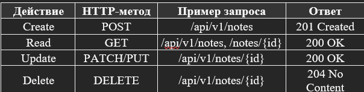

---
# Практическое задание 11

## ЭФМО-02-25 

## Алиев Каяхан Командар оглы
---
# Информация о проекте
Проектирование REST API (CRUD для заметок). Разработка структуры

## Цели занятия
1.	Освоить принципы проектирования REST API.
2.	Научиться разрабатывать структуру проекта backend-приложения на Go.
3.	Спроектировать и реализовать CRUD-интерфейс (Create, Read, Update, Delete) для сущности «Заметка».
4.	Освоить применение слоистой архитектуры (handler → service → repository).
5.	Подготовить основу для интеграции с базой данных и JWT-аутентификацией в следующих занятиях.

## Файловая структура проекта:


## Ключевые компоненты

main.go - точка входа приложения

note_mem.go – in-memory репозиторий (аналог db.go для хранения данных в памяти)

repository.go – интерфейс репозитория (абстракция для работы с данными)

handlers/notes.go – обработчики HTTP-запросов

router.go – маршрутизация

note.go – модель данных (сущность)

note_service.go – бизнес-логика (service layer)

go.mod - файл модуля Go: описание зависимостей (chi v5), версия Go, имя модуля

# Примечания по конфигурации и требования

Для запуска требуется:

Go: версия 1.25.1

PostgreSQL: версия не ниже 14


# Команды запуска/сборки
Для запуска http нужно выполнить 4 шага:
## 1) Клонировать данный репозиторий в удобную для вас папку:
```Powershell
git clone https://github.com/kayahan81/PZ11-Noteapi
```
## 2) Перейти в папку http:
```Powershell
cd PZ11-Noteapi
```
## 3) Загрузка зависимостей:
```Powershell
go mod tidy
```
## 4) Команда запуска
```Powershell
go run .
```

# Команда сборки
Для сборки бинарника и запуска .exe файла используются данные программы

```Powershell
go build -o server.exe .
server.exe
```
# Проверка работоспособности

## Базовый функционал

Проверка создания таблицы, добавления задач, подключения к бд и вывода задач


## Проверочные задания

Функция ListDone


Функция FindByID


Функция CreateMany


Вывод и подсчёт текущих задач 


## Контрольные вопросы
1.	Что означает аббревиатура REST и в чём её суть?
REST (Representational State Transfer) — это архитектурный стиль взаимодействия клиентских и серверных приложений через протокол HTTP.
Основные принципы:	Ресурсность — всё в API представлено как ресурс (например, /notes).	Стандартизированные методы HTTP:
o	GET — получение данных;
o	POST — создание ресурса;
o	PATCH/PUT — обновление;
o	DELETE — удаление.
Без состояния (stateless) — каждый запрос содержит всю необходимую информацию.
Единообразие интерфейса — структура запросов и ответов одинакова для всех ресурсов.

2.	Как связаны CRUD-операции и методы HTTP?

3.	Для чего нужна слоистая архитектура (handler → service → repository)?
4.	Что означает принцип «stateless» в REST API?
5.	Почему важно использовать стандартные коды ответов HTTP?
6.	Как можно добавить аутентификацию в REST API?
7.	В чём преимущество версионирования API (например, /api/v1/)?
